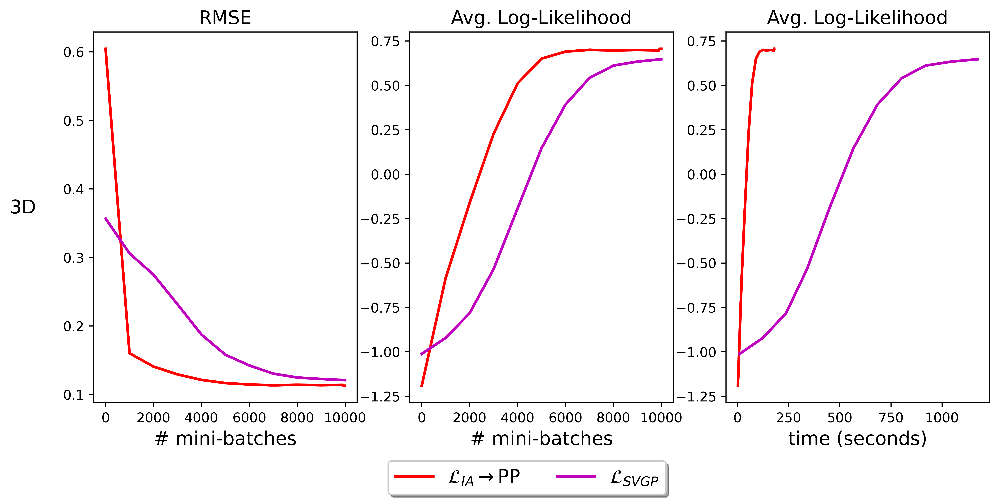

# Sparse Information Filter for Fast Gaussian Process Regression   

#### Table of Contents

* [What is Sparse Information Filter for fast GP regression?](#what-is-sparse-information-filter-for-fast-GP-regression?)
* [Installing the demo](#installing-the-demo)
* [Running the demo](#running-the-demo)
* [Citing the work](#citing-the-work)
* [License](#license)

## What is Sparse Information Filter for fast GP regression?

Gaussian processes (GPs) are an important tool in machine learning and applied
mathematics with applications ranging from Bayesian optimization to the calibration
of computer experiments. They constitute a powerful kernelized non-parametric
method with well-calibrated uncertainty estimates, however, off-the-shelf GP
inference procedures are limited to datasets with a few thousand data points
because of their cubic computational complexity. For this reason, many sparse
GPs techniques were developed over the past years. In this work, access the [paper](https://2021.ecmlpkdd.org/wp-content/uploads/2021/07/sub_854.pdf), 
we focus on GP regression tasks and propose a new algorithm to train variational
sparse GP models. An analytical posterior update expression based on the 
Information Filter is derived for the variational sparse GP model.

We benchmark our method on several real datasets with millions of data points against the state-of-the-art Stochastic Variational GP (SVGP) and 
sparse orthogonal variational inference for Gaussian Processes (SOLVEGP). 
Our method achieves comparable performances to SVGP and SOLVEGP while providing considerable speed-ups. Specifically, it is consistently four times faster than
SVGP and on average 2.5 times faster than SOLVEGP.

## Installing the demo

To run the demo, you need to have python 3.8 installed in your system. 
If you use macOS, a simple installation wizard can be downloaded from [python.org](https://www.python.org/ftp/python/3.8.5/python-3.8.5-macosx10.9.pkg).
For Linux, simply run the following command in your terminal 
```
sudo apt install python3.8
```

Next, clone this repository to your desired location, for instance, to download 
the code to a folder named ```code``` in your downloads folder run
```
git clone git@github.com:lkania/Sparse-IF-for-Fast-GP.git ~/Downloads/code
```

Finally, change the permissions of ```run.sh``` so that it's able to create a python
virtual environment for you with all the necessary packages. You can do so by executing
```
chmod +x ~/Downloads/code/run.sh
```

## Running the demo

In order to produce a quick result, the demo benchmarks only two different ways of
training Sparse Gaussian Processes on a 3-dimensional problem with 50 inducing points: the state-of-the-art Stochastic Variational 
GP (SVGP), denoted  in the figure below,
and our method based on the Information Filter, denoted 
 in the figure. 
After finishing the collection of statistics, the following figure will be produced



which shows the performance of the methods as measured by root mean squared error
(RMSE) and average log-likelihood (w.r.t. number of mini-batches and runtime measured in seconds). 

To run the demo, execute the following command 
```
sh ~/Downloads/code/run.sh
```
The script will proceed to create a python virtual environment called ```ifsgp``` with
the necessary libraries and run the above-mentioned experiment.

The dimension of the problem, the number of inducing points, and the methods being benchmarked can be easily changed by modifying the file ```src/experiments.py```.
In it, you will find the instructions regarding how to modify it.
For benchmarking SOLVEGP, please access the authors' repository [github.com/thjashin/solvegp](https://github.com/thjashin/solvegp).

## Citing the work

To cite this work, please reference the corresponding [ECML PKDD 2021 paper](https://2021.ecmlpkdd.org/wp-content/uploads/2021/07/sub_854.pdf) 
```
@article{SparseIFforGP,
  author = {Kania, Lucas and Sch\"urch, Manuel and Azzimonti, Dario and Benavoli,Alessio},
  title = {Sparse Information Filter for Fast Gaussian Process Regression},
  year = {2021},
  journal = {},
  url = {}
}
```

## License

You can find the MIT license in the [LICENSE](https://github.com/lkania/Sparse-IF-for-Fast-GP/blob/main/LICENSE) file.
